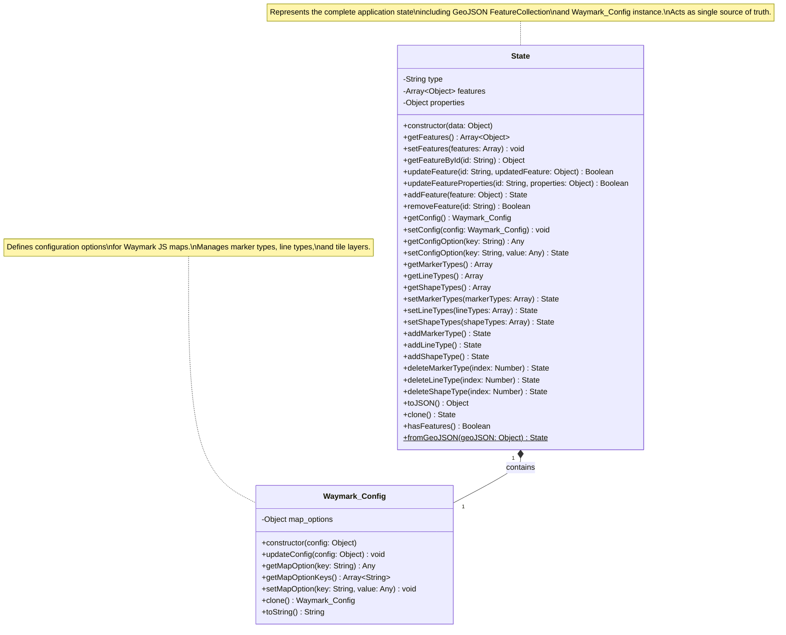

# Class Diagram: State and Waymark_Config

## Class Relationships

- **State** has a **composition** relationship with **Waymark_Config**
  - The State class contains a Waymark_Config instance in its properties
  - The lifecycle of Waymark_Config is managed by State
  - State provides methods to access and modify the configuration

## Key Features

### State Class
- **Data Management**: Manages GeoJSON features and application configuration
- **Reactivity Support**: Methods create new array/object references for Vue reactivity
- **Feature Operations**: CRUD operations for map features
- **Configuration Access**: Proxy methods to access Waymark_Config options
- **Serialization**: JSON conversion and cloning capabilities
- **Factory Method**: Static method to create State from GeoJSON

### Waymark_Config Class
- **Configuration Management**: Stores map options including marker types, line types, and tile layers
- **Default Values**: Provides sensible defaults for map configuration
- **Deep Cloning**: Ensures configuration independence through deep copying
- **Flexible Access**: Get/set methods for configuration options
